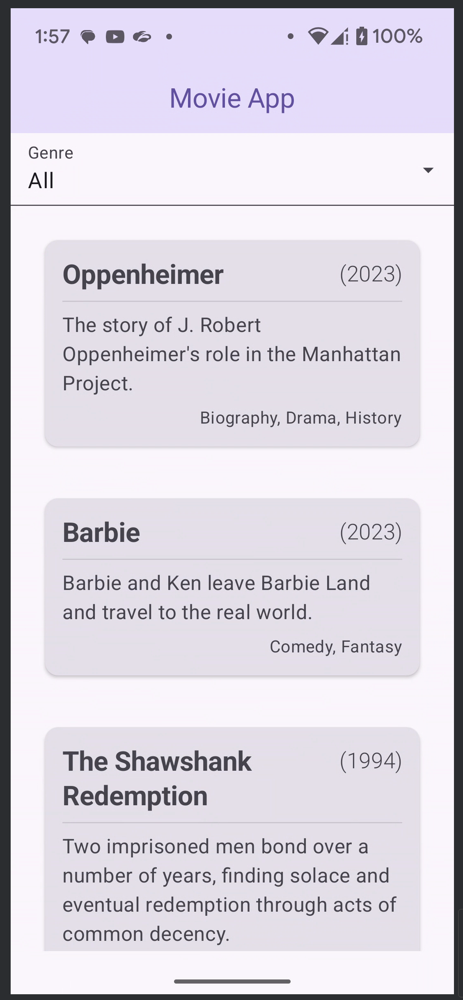

# Movie Explorer
An IMDB Movie Browser

*Coding exercise performed as Step 2 of Brilliant.org interview process.*

## Architecture

The project utilizes the Repository pattern, fetching data from the API in the background, populating a local Room database. The data is provided to the UI from the local database, and the database is periodically refreshed as needed in the background. This provides a more performant user experience, as upon subsequent app interactions data is already persisted locally. The user has also been given an option to manually force a data refresh by pressing a refresh button button.

The app makes use of MVI for unidirectional data flow, which works well with Compose UI and Flow.

## Screenshots

Mock Data, demostrating titel/year layout with very long titles:

{width=10%}

## Future Features

Nice to have features, which were not part of the requirement, that I would add if I were to continue developing this app:

- favorites feature - enable favoriting movies
- detail view - rather than going to IMBD in the detail view, show a movie detail screen
  - enable movie thumbnail, tapping the thumbnail plays movie trailer if available
  - movie trailers might come from a separate API
