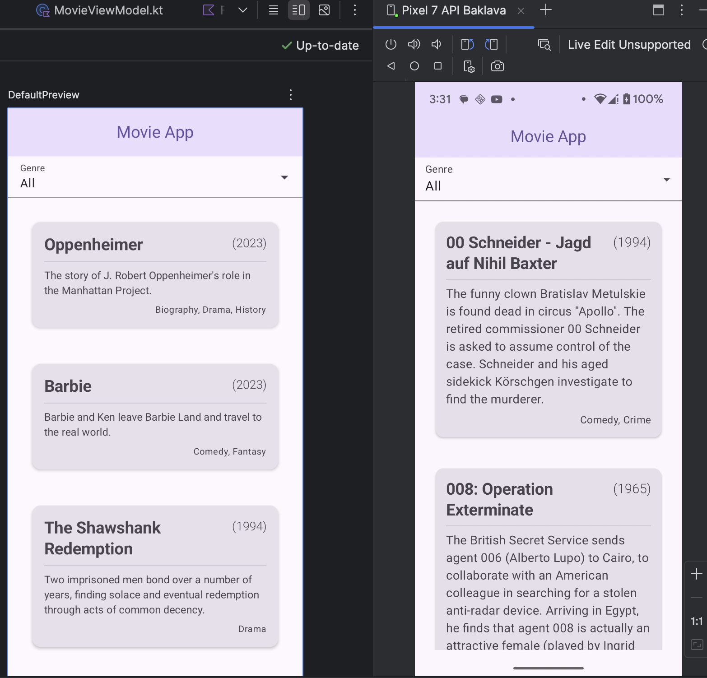

# Movie Explorer
An IMDB Movie Browser

## Architecture

The project utilizes the Repository pattern, fetching data from the API in the background, populating a local Room database. The data is provided to the UI from the local database, and the database is periodically refreshed as needed in the background. This provides a more performant user experience, as upon subsequent app interactions data is already persisted locally. The user has also been given an option to manually force a data refresh by pressing a refresh button button.

The app makes use of MVI for unidirectional data flow, which works well with Compose UI and Flow.

Lazy loading is used to handle the large dataset effectively. 

## Screenshots

Mock Data, demostrating titel/year layout with very long titles:

Mock Data for Compose Preview, live data from API in-app:

## Challenges

The top challenge for me was finding the time to do the exercise. Four hours might not seem like a lot of time, but after I returned from travels I was only able to put in about half that, before a long break and then putting in the rest of the time. The next biggest challenge for me was trying to complete the requirements in the alloted time. Four hours isnt' a lot of time to complete all the requirements as listed. I tend to like to take my time, coding carefully and thinking about both UI and UX from the user perspective as well as efficiency and architecture from the development perspective. For example, I spent time refactoring the layout to accommodate for long movie titles while still placing the movie release date in the upper right corner of the tile.

I did not have time to fix all of the unit tests.

## Learnings

Initially I started coding the app by hand. I'm a very visual person, so I like to think about the UI, break it down into a component level and then start from coding the UI with dummy data and no network access. I created the movie tile this way. At my current day job, we are resticted from using AI and the AI integration in our IDEs have been disabled. So it had been a while since I explored leveraging the built-in as well as external AI tools available for coding, as well as the AI-assisted autocomplete in Android Studio. I got to really play with those tools during this exercise, and I was really pleasantly surprised at how far they have come. Fortuneatly I have spent time previously learning a bit of prompt engineering, so I was able to get both Gemini and Claude.ai to write code for me according to my own architectural preferences. This saved me a tremendous amount of time. In fact, the way in which Jetbrains pulled off integration of AI into autocomplete *really* blew my mind. I really look forward to using these tools much more in the future.

## Future Features

Nice to have features, which were not part of the requirement, that I would add if I were to continue developing this app:

- favorites feature - enable favoriting movies
- detail view - rather than going to IMBD in the detail view, show a movie detail screen
  - enable movie thumbnail, tapping the thumbnail plays movie trailer if available
  - movie trailers might come from a separate API
